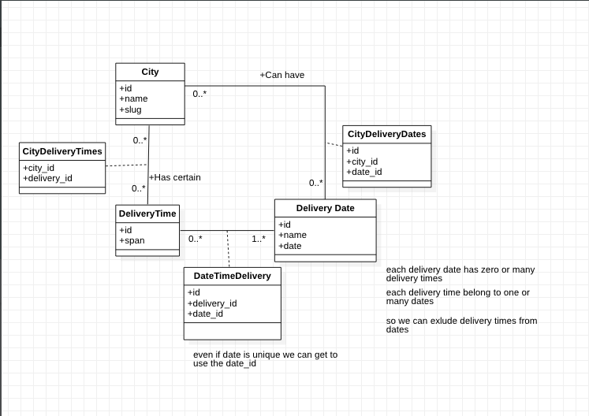
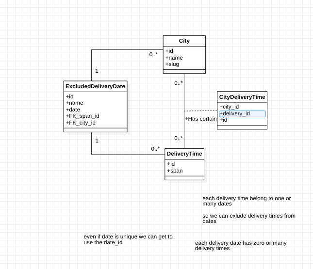

### Devinweb Test

### System Design V0.1

### System Design V0.2
based on the problem of excluded delivery time from cerain dates, we can proceed to use an easy filter. The filter consists of creating a Table which contains only the excluded delivery times from certain dates.

#### Endpoints 
Handles City(name,slug) POST Req
Route::apiResource('city', 'CitiesController');

Handles delivery times spans(id, span) POST Req.
Route::apiResource('delivery-times','DeliveryTimesController');

Handles Attach city delivery times
'''Route::post('/city/{city}/delivery-times','AttachCityDeliveryTimeController@store');
'''

Handles excluding some city delivery times
''' Route::post('/spans/{city_id}/exclude','ExcludeSpansConroller@excludeDateSpans');
'''

Handles excluding city delivery by excluding all of the daily
delivery times
''' Route::post('/delivery-date/{city_id}','ExcludeSpansConroller@excludeDate'); '''

list delivery dates 
''' Route::post('/city/{city_id}/delivery-dates-times/{number_of_days}','ValidDateConroller@index');
 '''